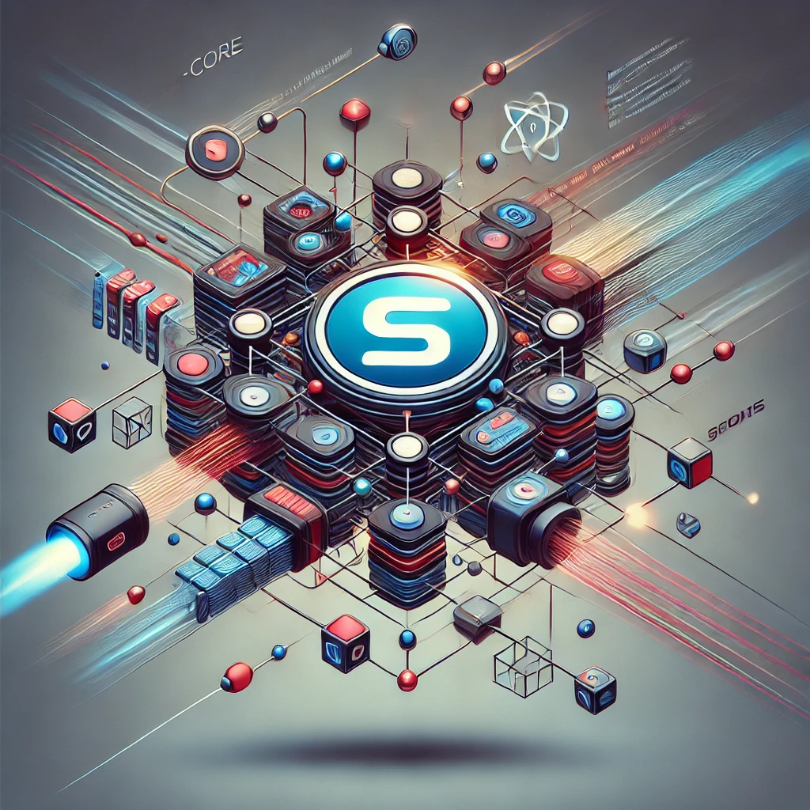

- [Overview](#overview)
- [Key Features](#key-features)
	- [Microservices and Cells](#microservices-and-cells)
	- [High Performance](#high-performance)
	- [Real-time Communication](#real-time-communication)
	- [Cluster Management](#cluster-management)
	- [Integrated Redis and MongoDB Support](#integrated-redis-and-mongodb-support)
- [Documentation](#documentation)
- [Installation](#installation)
- [Usage Examples](#usage-examples)
	- [Using EventsDomain for Microservices Communication](#using-eventsdomain-for-microservices-communication)
	- [Creating Controllers](#creating-controllers)
	- [Integrating Controllers with RouteControllers](#integrating-controllers-with-routecontrollers)
	- [Server-Sent Events (SSE)](#server-sent-events-sse)
	- [Cluster Management](#cluster-management-1)
- [License](#license)

**Author**: César Casas
**LinkedIn**: [César Casas](https://www.linkedin.com/in/cesarcasas/)
**Website**: [s42core.com](https://s42core.com)

## Overview

`s42-core` is a powerful and flexible library built on Bun.js, designed to simplify the development of applications, especially those using microservices and cell-based architectures. This library supports the creation of modular and reusable software components and streamlines the implementation of high-performance monorepos.

## Key Features

### Microservices and Cells

`s42-core` enables the creation of scalable and modular applications with independent microservices or cells. This architecture ensures maintainability and simplifies updates.

### High Performance

Applications built with `s42-core` benefit from exceptional performance, leveraging the speed of Bun.js and efficient design patterns.

### Real-time Communication

Supports Server-Sent Events (SSE) for real-time updates, making it ideal for notifications, live data feeds, and collaborative applications.

### Cluster Management

Easily manage worker processes, enabling efficient utilization of multicore systems, with support for development features like file watching.

### Integrated Redis and MongoDB Support

Provides utilities for managing Redis and MongoDB connections and operations, streamlining data management in modern applications.

## Documentation

Detailed documentation for each class and module is available:

- [CLUSTER.md](./DOCUMENTATION/CLUSTER.md)
- [CONTROLLER.md](./DOCUMENTATION/CONTROLLER.md)
- [DEPENDENCIES.md](./DOCUMENTATION/DEPENDENCIES.md)
- [EVENTSDOMAIN.md](./DOCUMENTATION/EVENTSDOMAIN.md)
- [JSONPARSE.md](./DOCUMENTATION/JSONPARSE.md)
- [MONGODB.md](./DOCUMENTATION/MONGODB.md)
- [REDISDB.md](./DOCUMENTATION/REDISDB.md)
- [ROUTECONTROLLERS.md](./DOCUMENTATION/ROUTECONTROLLERS.md)
- [SSE.md](./DOCUMENTATION/SSE.md)
- [TEST.md](./DOCUMENTATION/TEST.md)

---

## Installation

Install `s42-core` using your preferred package manager:

```bash
npm install s42-core
```

---

## Usage Examples

### Using EventsDomain for Microservices Communication

The `EventsDomain` class enables seamless event-based communication between microservices. For example, you can use it to emit an event from a user registration service and listen to it in an email notification service.

```typescript
import { EventsDomain, RedisClient } from 's42-core';

const redisInstance = RedisClient.getInstance('redis://localhost:6379');
const eventsDomain = EventsDomain.getInstance(redisInstance, 'service-uuid');

// Emit an event
eventsDomain.emitEvent('user.registered', {
  email: 'example@example.com',
  name: 'John Doe',
});

// Listen to an event
eventsDomain.listenEvent('user.registered', (payload) => {
  console.info('User registered:', payload);
});
```

---

### Creating Controllers

Controllers handle HTTP requests and middleware. Here’s an example of creating a simple controller:

```typescript
import { Controller } from 's42-core';

const userController = new Controller('POST', '/users', async (req, res) => {
  const userData = req.body;
  console.info('User data received:', userData);
  res.json({ success: true, data: userData });
});
```

---

### Integrating Controllers with RouteControllers

RouteControllers organize and manage multiple controllers efficiently:

```typescript
import { RouteControllers, Controller } from 's42-core';

const healthController = new Controller('GET', '/health', async (req, res) => {
  res.text('OK');
});

const router = new RouteControllers([userController, healthController]);

// Use the router in your server
server.start({ RouteControllers: router });
```

---

### Server-Sent Events (SSE)

Easily implement real-time communication with the SSE class:

```typescript
import { SSE, Controller } from 's42-core';

const sseController = new Controller('GET', '/events', async (req) => {
  const sse = new SSE(req);
  setInterval(() => {
    sse.send({ eventName: 'time', eventPayload: { time: new Date().toISOString() } });
  }, 1000);
  return sse.getResponse();
});
```

---

### Cluster Management

The `Cluster` class simplifies worker process management:

```typescript
import { Cluster } from 's42-core';

const cluster = new Cluster({ name: 'example-cluster', maxCPU: 4, watch: true });

cluster.start('./worker.js', (error) => {
  if (error) console.error('Cluster failed:', error);
});

cluster.onWorkerMessage((message) => {
  console.info('Message from worker:', message);
});
```

---

## License

`s42-core` is licensed under the MIT License. See the LICENSE file for more details.

---

Powered by César Casas - [LinkedIn](https://www.linkedin.com/in/cesarcasas/).

