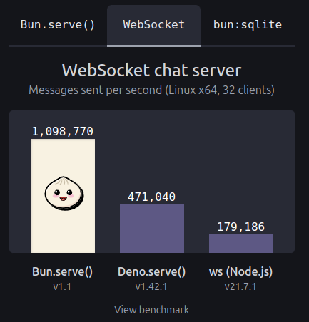

# s42-core
- [s42-core](#s42-core)
	- [Overview](#overview)
	- [Working with monorepos](#working-with-monorepos)
		- [Creating a Monorepo](#creating-a-monorepo)
	- [Key Features](#key-features)
		- [Microservices and Cells](#microservices-and-cells)
		- [High Performance](#high-performance)
	- [Documentation](#documentation)
	- [Installation](#installation)
		- [Example Implementation for listen Events](#example-implementation-for-listen-events)
		- [Creating controllers](#creating-controllers)
		- [Using controllers](#using-controllers)
		- [Creating a Monorepo with Microservices](#creating-a-monorepo-with-microservices)

**Author**: César Casas
**LinkedIn**: [César Casas](https://www.linkedin.com/in/cesarcasas/)
**Website**: [s42core.com](https://s42core.com)

## Overview

`s42-core` es una poderosa y flexible biblioteca Bun.js diseñada para facilitar el desarrollo de aplicaciones, en particular aquellas que utilizan arquitecturas de microservicios y celdas. La biblioteca simplifica la creación de monorepos y apoya el desarrollo de componentes de software pequeños y reutilizables (atoms).


## Working with monorepos

`s42-core` simplifica la creación de monorepos y apoya el desarrollo de componentes de software pequeños y reutilizables (atoms).
Para trabajar con monorepos, necesitar tener instalado `bun` y `bun-cli`.
[Bun.js](https://bun.sh/) es una plataforma de JavaScript moderna y rápida que ejecuta código javascript en backend. Es igual a Node.js, pero mucho más rápido (en algunos benchmarks es hasta 20x más rápido).



### Creating a Monorepo

```bash
$ mkdir my-monorepo
$ cd my-monorepo
$ bun init
```

## Key Features

### Microservices and Cells

`s42-core` es construido con arquitecturas de microservicios y celdas en mente, lo que permite crear aplicaciones altamente modulares y escalables. Cada microservicio o celda puede operar independientemente, facilitando la mantenimiento y actualizaciones más fáciles.

### High Performance
Aplicaciones desarrolladas con `s42-core` benefician de una excelente rendimiento, lo que lo hace adecuado para entornos de alto tráfico.


## Documentation

For detailed information on each class and module provided by `s42-core`, refer to the following documentation files:

- [CLUSTER.md](./DOCUMENTATION/CLUSTER.md)
- [CONTROLLER.md](./DOCUMENTATION/CONTROLLER.md)
- [DEPENDENCIES.md](./DOCUMENTATION/DEPENDENCIES.md)
- [EVENTSDOMAIN.md](./DOCUMENTATION/EVENTSDOMAIN.md)
- [JSONPARSE.md](./DOCUMENTATION/JSONPARSE.md)
- [MONGODB.md](./DOCUMENTATION/MONGODB.md)
- [REDISDB.md](./DOCUMENTATION/REDISDB.md)
- [ROUTECONTROLLERS.md](./DOCUMENTATION/ROUTECONTROLLERS.md)
- [SHUTDOWN.md](./DOCUMENTATION/SHUTDOWN.md)
- [TEST.md](./DOCUMENTATION/TEST.md)

---

## Installation
Installing `s42-core` is simple. You can add it to your project using your preferred package manager.

```bash
npm install s42-core
```

### Example Implementation for listen Events
Here's a simple example of how to implement a microservice using s42-core:

```typescript
import { createServer } from 'node:http'

import { Shutdown, Cluster, EventsDomain, Dependencies, RedisClient } from 's42-core'

import { listenEventsDomain } from './eventsDomain/Listeners'

import { Router } from './routers.js'

Cluster(
	2,
	async (pid, uuid) => {
		console.info('initializing: ', pid, uuid)
		const redisInstance = RedisClient.getInstance(process.env.REDIS_URI)
		const eventsDomain = EventsDomain.getInstance(redisInstance, uuid)

		Dependencies.add<EventsDomain>('eventsDomain', eventsDomain)
		Dependencies.add<RedisClient>('redisInstance', redisInstance)

		listenEventsDomain(eventsDomain)

		const server = createServer(Router)
		server.listen(process.env.PORT, () =>
			console.info(`ready on *:${process.env.PORT} : PID: ${pid}`),
		)
		Shutdown([eventsDomain.close, redisInstance.close])
	},
	() => {
		console.info('Error trying start servers')
	},
)

```
*eventsDomain/Listeners*

```typescript
import { type EventsDomain } from 's42-core'

type UsersCreated = {
	email: string
	firstName: string
	lastName: string
	lang: 'en' | 'es' | 'it' | 'fr'
	template: string
}

export function listenEventsDomain(eventsDomain: EventsDomain) {
	eventsDomain.listenEvent<UsersCreated>(
		'users.created',
		async (payload: UsersCreated) => {
			try {
				console.info('Email sent successfully:', payload)
			} catch (error) {
				console.error('Error sending email:', error)
			}
		},
	)
}

```

### Creating controllers
```typescript
import { Dependencies, type MongoClient, type EventsDomain, Controller } from 's42-core'
import { z } from 'zod'

const TypeUser = z.object({
	firstName: z.string(),
	lastName: z.string(),
	email: z.string().email(),
})

export const userController = new Controller()
	.setPath('/users/create')
	.post()
	.use(async (req, res, next) => {
		console.info('This is a mws: ', req.query)
		next()
	})
	.use(async (req, res) => {
		const db = Dependencies.get<MongoClient>('db') as MongoClient
		const eventsDomain = Dependencies.get<EventsDomain>('eventsDomain') as EventsDomain

		try {
			const data = req.body
			TypeUser.parse(data)
			await db.getCollection('users').insertOne({
				...data,
				remoteIp: req.realIp,
				added: new Date(),
				headers: req.headers,
			})

			eventsDomain.emitEvent('users.created', { ...data })
			res.json({ ok: true })
		} catch (error) {
			res.jsonError({ ok: false, msg: error })
		}
	})

```

### Using controllers
```typescript
import { createServer } from 'node:http'

import {
	Shutdown,
	Cluster,
	Dependencies,
	MongoClient,
	RedisClient,
	EventsDomain,
	RouteControllers,
} from 's42-core'

import { userController, healthController } from './controllers'

const port = process.env.PORT ?? 3000

Cluster(
	1,
	async (pid, uuid) => {
		console.info('initializing: ', pid, uuid)
		const mongoClient = MongoClient.getInstance({
			connectionString: String(process.env?.MONGO_URI),
			database: String(process.env?.MONGO_DB),
		})

		await mongoClient.connect()
		const redisClient = RedisClient.getInstance('localhost')

		const eventsDomain = EventsDomain.getInstance(redisClient, uuid)

		Dependencies.add<MongoClient>('db', mongoClient)
		Dependencies.add<RedisClient>('redis', redisClient)
		Dependencies.add<EventsDomain>('eventsDomain', eventsDomain)

		const routerControllers = RouteControllers.getInstance([
			userController,
			healthController,
		])
		const server = createServer(routerControllers.getCallback())

		server.listen(port, () => {
			console.info(`ready on *:${port}`)
		})
		Shutdown([mongoClient.close, redisClient.close, eventsDomain.close])
	},
	() => {
		console.info('Error trying start servers')
	},
)

```


### Creating a Monorepo with Microservices


s42-core is designed to work seamlessly within a monorepo. Here's a basic structure for a monorepo that includes multiple microservices:
```text
monorepo/
│
├── microservices/
│   ├── service1/
│   │   ├── package.json
│   │   └── src/
│   ├── service2/
│   │   ├── package.json
│   │   └── src/
│   └── service3/
│       ├── package.json
│       └── src/
│
├── package.json
├── tsconfig.json
└── README.md
```

For more detailed documentation, please refer to the individual markdown files listed above.

---

Powered by César Casas - [LinkedIn](https://www.linkedin.com/in/cesarcasas/)

